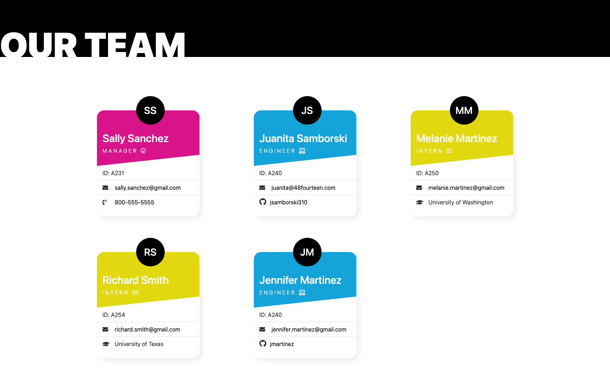
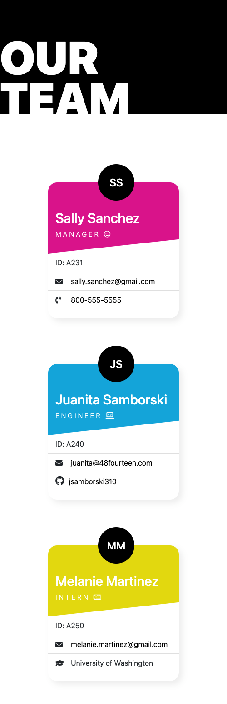
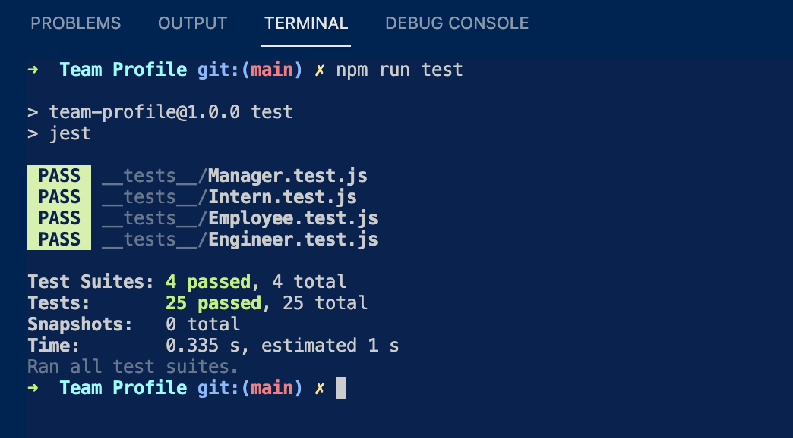

  
  
# Team Profile

Generates an application that allows an employer to create a basic team profile. Runs with Node.js.

## Description
This command-line application generates a professional mobile responsive webpage based on user input. An employer can enter information about it's employees and provide specific information based on employee role. Upon completion, the employer can view a professional webpage containing the information, with phone numbers, email addresses, and Github links being clickable for ease. 

This application was built using the following:

* Node.js
* Javascript
* HTML & CSS

## Table of Contents

  * [Description](#description)
  * [Installation](#installation)
  * [License](#license)
  * [Usage](#usage)
  * [Tests](#tests)
  * [Questions](#questions)

## Installation

Clone the repository onto your local environment. 

The following dependancies, listed in `package.json` must be installed to run this application: 

`npm install inquirer` to collect user input.

`npm install jest` to run unit tests.

## License

This application is covered under the MIT license.

## Usage

https://www.loom.com/share/3d527e9f495d41bebef3daeb88933e7a

Right-click the application and open it in terminal. 

In the terminal, type `node index.js` 

The application will commence to display a series of questions. 

After all of the questions are answered, an index.html will be generated in the dist folder, containing all of the information that has been provided. This file may be opened in the browser to view as a webpage.

A sample test has been generated. Check out the sample.html in the root. 

## Tests

Created unit testing to ensure that the application runs as intended and minimizes bugs and errors during future development. 

## Questions

For questions about this application or if you would like to collaborate, connect with me on <a href="https://www.linkedin.com/in/juanita-samborski/" target="_blank">Linkedin</a>.

